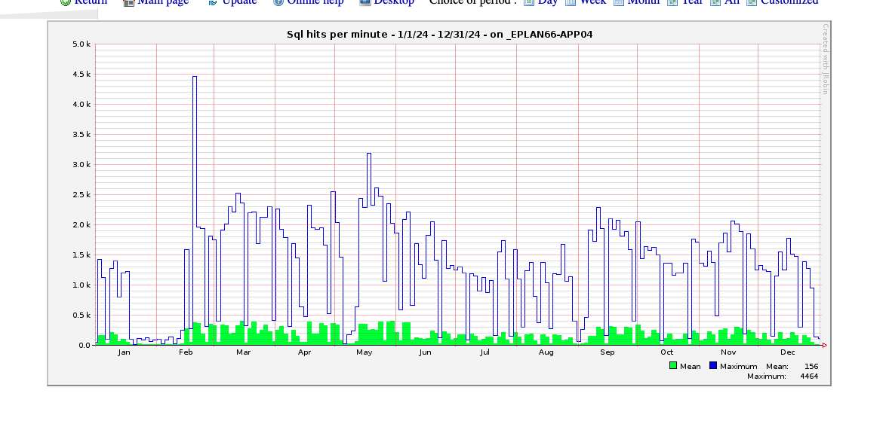

# Case Study: Performance Optimization for National Budgeting MIS (e-Plan)

## Project Overview

The e-Plan system is the primary Management Information System (MIS) utilized for the planning, monitoring, and evaluation of budget expenditures for local government organizations across Thailand. As the Hands-on Technical Lead, I supervised a team of full-stack Java developers while ensuring the stability and performance of this critical nationwide enterprise application.

## The Technical Challenge

- **National Scale:** Supporting thousands of concurrent government officials during peak national budgeting and reporting windows.
- **Enterprise Legacy Stack:** Maintaining a robust, high-availability architecture built on Struts, Spring, Hibernate, and JSP.
- **Data Integrity:** Managing high-volume transactional data within a centralized Oracle database environment.

## Runtime Monitoring & SQL Optimization d

To maintain a **0.00% crash rate** during peak national cycles, I implemented **JavaMelody** for real-time health monitoring. This proactive approach allowed our team to identify and resolve bottlenecks before they impacted end-users.

- **Performance Engineering**: Optimized the system to sustain ~4,500 SQL hits per minute without performance degradation during high-traffic periods.

- **Oracle Performance Tuning**: Refactored complex Oracle SQL queries—specifically replacing nested subqueries with indexed joins—to eliminate database deadlocks and reduce CPU utilization.

- **Proactive JVM Monitoring**: Tracked memory usage, thread counts, and SQL execution statistics to ensure connection stability under heavy load.

- **Real-Time Monitoring:** Leveraged JavaMelody to track JVM health, memory usage, and SQL execution statistics during peak traffic periods.

## Full-Stack Leadership & Orchestration

As a Supervisor, I managed the end-to-end technical environment for my team, ensuring consistent delivery and high-quality code across the entire stack:

- **Environment Orchestration:** Managed technical onboarding and setup for the team, including Eclipse IDE configuration, build tool integration, and database resource mapping.
- **Quality Engineering:** Established an automated "Quality Gate" suite utilizing JUnit, Gatling, and SonarQube, which resulted in a 50% reduction in production defect rates.
- **Resource Management:** Oversaw the integration between the application layer and the Oracle database server, ensuring stable resource availability during high-concurrency peaks.
- **Deployment Automation:** Engineered custom Ant build scripts for Linux server deployments, significantly reducing manual overhead and ensuring environment parity.

## Technical Stack

- **Backend:** Java, Struts, Spring, Hibernate
- **Frontend:** JSP, OpenLayers (GIS)
- **Monitoring:** JavaMelody
- **Database:** Oracle (Primary)
- **Tools:** Eclipse, Ant Build, DBeaver, Gatling, SonarQube
